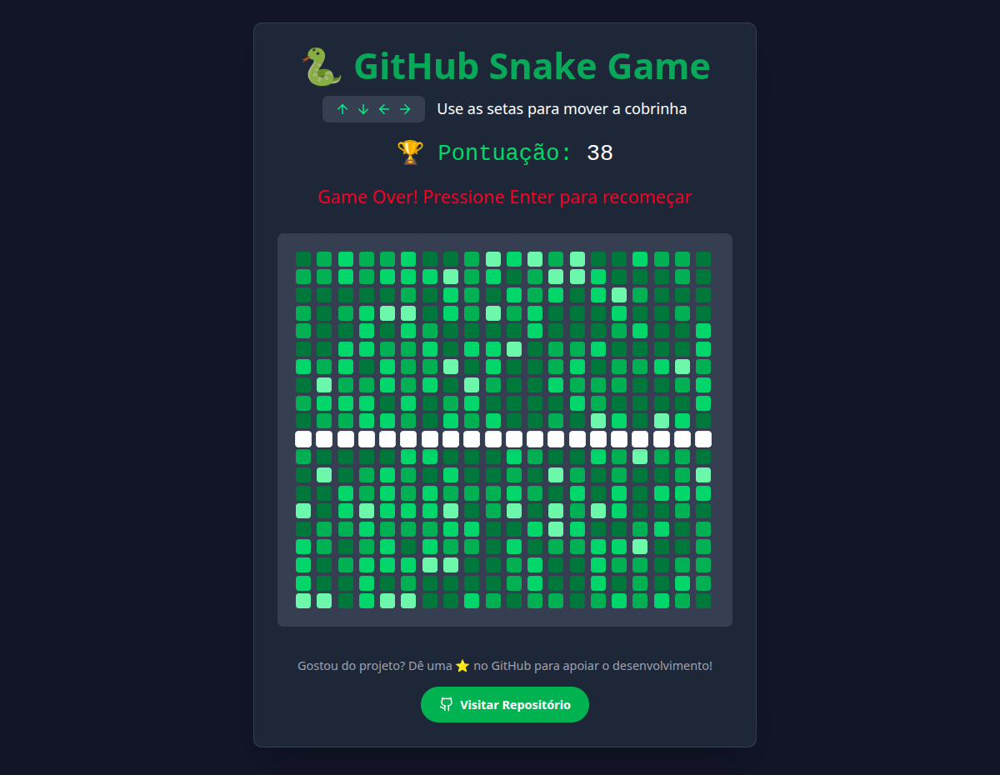

# 🐍 GitHub Snake Game

Um jogo da cobrinha inovador que transforma sua jogada em um gráfico de contribuições do GitHub!

## ✨ Features

- 🕹️ **Jogo clássico** com controles intuitivos (setas do teclado)
- 🌱 **Crescimento visual** simulando contribuições no GitHub
- 🎨 **Cores dinâmicas** (0-4 níveis de contribuição)
- 📊 **Sistema de pontuação** em tempo real
- 🔄 **Reinício automático** ao game over
- 📱 **Totalmente responsivo** (desktop e mobile)

## 🚀 Como rodar localmente

# Clone o repositório
git clone https://github.com/a21ns1g4ts/github-snake-game.git
cd github-snake-game

# Instale as dependências
    npm install

# Inicie o servidor de desenvolvimento
    npm run dev

Acesse: [http://localhost:3000](http://localhost:3000)

## 🛠 Stack Tecnológica

| Tecnologia       | Descrição                          |
|------------------|------------------------------------|
| React           | Biblioteca para construção de UI   |
| TypeScript      | JavaScript tipado                  |
| Tailwind CSS    | Framework CSS utilitário           |
| Lucide Icons    | Ícones modernos                    |
| Vite            | Build tool ultra-rápida            |

## 🎮 Controles

↑ - Mover para cima

↓ - Mover para baixo

← - Mover para esquerda

→ - Mover para direita

Enter - Reiniciar jogo

## 🤝 Quer contribuir?

1. Faça um fork do projeto
2. Crie sua branch (`git checkout -b feature/nova-feature`)
3. Commit suas mudanças (`git commit -m 'Adiciona nova feature'`)
4. Push para a branch (`git push origin feature/nova-feature`)
5. Abra um Pull Request

## 📄 Licença

MIT License - veja o arquivo [LICENSE](LICENSE) para detalhes.
